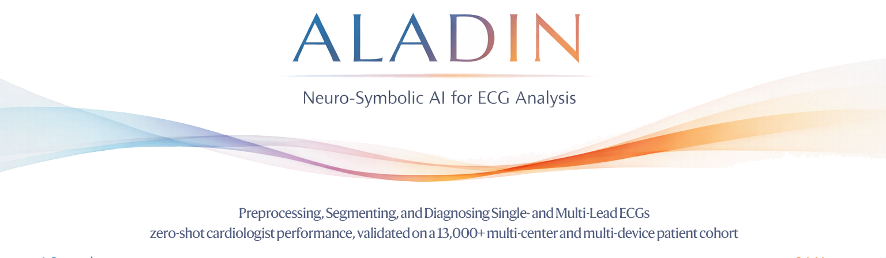

[](https://github.com/fastlib/ALADIN/actions/workflows/build.yaml)
[](https://pypi.org/project/aladin-ecg/)
[](https://pypi.org/project/aladin-ecg/)
[](https://pypi.org/project/aladin-ecg/)
[](https://pypi.org/project/aladin-ecg/)

ALADIN is a neuro-symbolic AI model that preprocesses, segments, and diagnoses single- and multi-lead ECG signals. It has been validated extensively on three diverse patient cohorts with a combined size of 13,780 patients. ALADIN can handle any ECG recording from clinical MUSE recordings to ambulatory ZioPatch sessions and handheld KardiaMobile measurements ranging from 6 seconds to 24 hours. 

Due to ALADIN's native, memory-level integration of PyTorch and its multithreaded C++ backend, ALADIN can easily process large datasets with up to millions of ECGs, while automatically adapting to hardware configurations that range from consumer laptops to high-performance clusters. 

## Installation

```bash
pip install aladin-ecg
```

Model weights are downloaded automatically and anonymously from the [Hugging Face repo `fastlib/ALADIN`](https://huggingface.co/fastlib/ALADIN) the first time they're needed, and cached in `~/.cache/huggingface/hub` (or `HF_HOME`/`HF_HUB_CACHE` if set). To skip the download, point the `aladin_models` environment variable at a local folder that already contains the weights.

### System requirements

- Linux Ubuntu ≥20.04, macOS ≥13.6, or Windows ≥10
- Python 3.11–3.14
- ≥8GB RAM
- A modern GPU with ≥12GB VRAM is recommended for training and inference; CPU-only inference is supported but slower

### Installing from source

```bash
git clone https://github.com/fastlib/ALADIN.git
cd ALADIN
python -m venv VENV
source VENV/bin/activate

pip install .
```

## Demo 
A runnable demo is available via:

```bash
python demo.py --case=[recording]
```

where `[recording]` is one of `STANFORD1`, `STANFORD2`, `A01986`, `A08391`.

## Usage 

```python
import numpy as np
from aladin import ALADIN #import framework
from aladin.core import Record #custom record class

# ecg is a dict keyed by lead name
# 1-12 leads are supported, models are selected based on lead presence, see below
fs = 250  # Hz
ecg = {"II": np.random.rand(fs * 10)}
record = Record(ecg, fs)

# modelpaths="auto" picks the pretrained 1-lead or 3-lead model based on which
# leads are available (lead II is required; the 3-lead model additionally needs
# V1 and V6, otherwise ALADIN falls back to the 1-lead model)
aladin = ALADIN(modelpaths="auto")

# only delineation 
aladin.segment(record) 
p = record.delineations.p.[binary|logits|uncertainty]
qrs = record.delineations.qrs.[binary|logits|uncertainty]
t = record.delineations.t.[binary|logits|uncertainty]
abnormal_qrs = record.delineations.abnormal_qrs.[binary|logits|uncertainty] #V beats
afib = record.delineations.afib.[binary|logits|uncertainty]
noise = record.delineations.noise.[binary|logits|uncertainty]

# delineation and diagnosis 
alading.analyse(record) 
results = record.to_dict()

# median beat extraction
aladin.extract_median_beat(record) 
median_beat = record.median_beat.ecg 
median_beat_delineations = record.median_beat.delineations.[p|qrs|t].[onset|offset|mask]
```

## Benchmark reproduction

See [benchmark.md](benchmark.md) for details on reproducing the published delineation and diagnosis benchmarks on the Stanford, RDB, and CinC datasets.

## Model card

For details on training data, intended use, performance, limitations, and responsible use, see the [Model Card](modelcard.md).

## Changelog

**1.1.2** — Added PyPI support

**1.1.1** — Cross-platform GitHub Actions, unit tests, automatic model weight downloads from Hugging Face

**1.1.0** — Support for 1-, 3-, and 12-lead ECG; median beat extraction and beat-median segmentations
